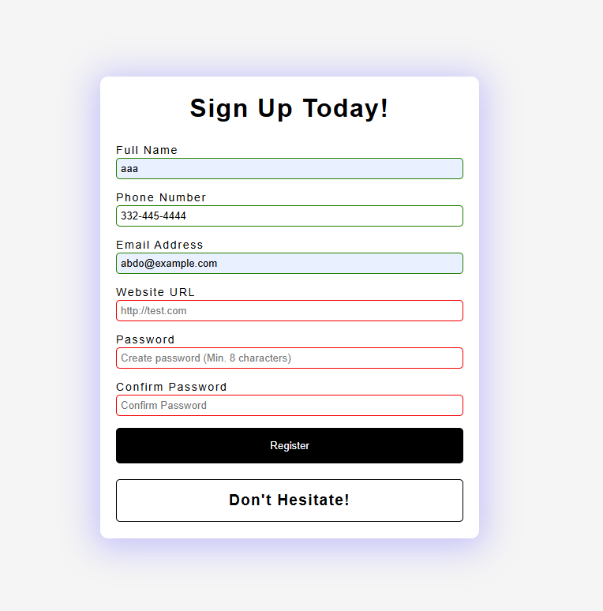

# Form Validator

A responsive and modern **form validation app** built using HTML, CSS, and vanilla JavaScript. This app validates form fields in real time, ensuring the user provides accurate and complete information before submitting.

---

## Features
- Real-time form validation using HTML5 and JavaScript
- Email format validation
- Phone number pattern matching (e.g. `555-555-5555`)
- Password validation (with complexity requirements)
- Confirm password match check
- Website URL validation
- Dynamic success/error message display
- HTML5 attributes (`required`, `pattern`, `minlength`, `maxlength`) for built-in validation
- Fully responsive layout

---
## Getting Started

1. Clone or download this repository.
2. Open `index.html` in any modern browser.
3. Fill in the form fields to see real-time validation.
4. Try submitting invalid input to see helpful error messages.

---
## Password Requirements

The password input requires the following:
- Minimum of **8 characters**
- At least **1 uppercase letter**
- At least **1 lowercase letter**
- At least **1 number**
This is enforced using the following regex pattern:

```regex
^(?=.*\d)(?=.*[a-z])(?=.*[A-Z])(?=.*[a-zA-Z]).{8,}$
```

If the **Confirm Password** field doesn’t match, the user is notified immediately.

---
## 📸 Preview

[demo](https://abdo-rabea.github.io/form-validator)



---

## Technologies Used

- **HTML5** – Form structure with native validation attributes
- **CSS3** – Layout and form styling
- **JavaScript (ES6)** – Custom validation and interactivity
